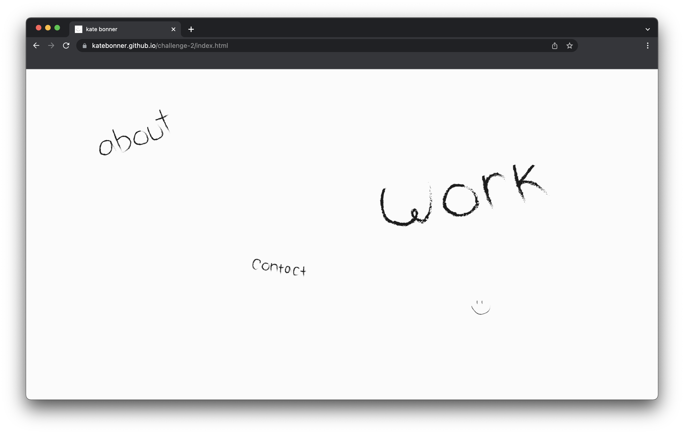
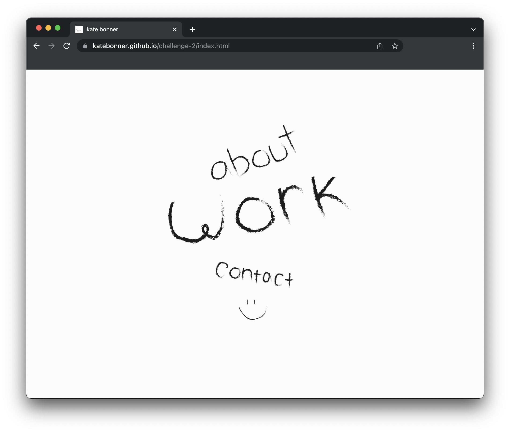
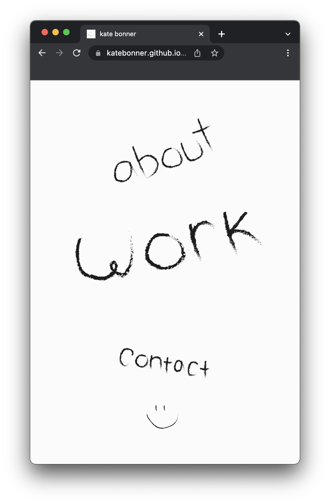
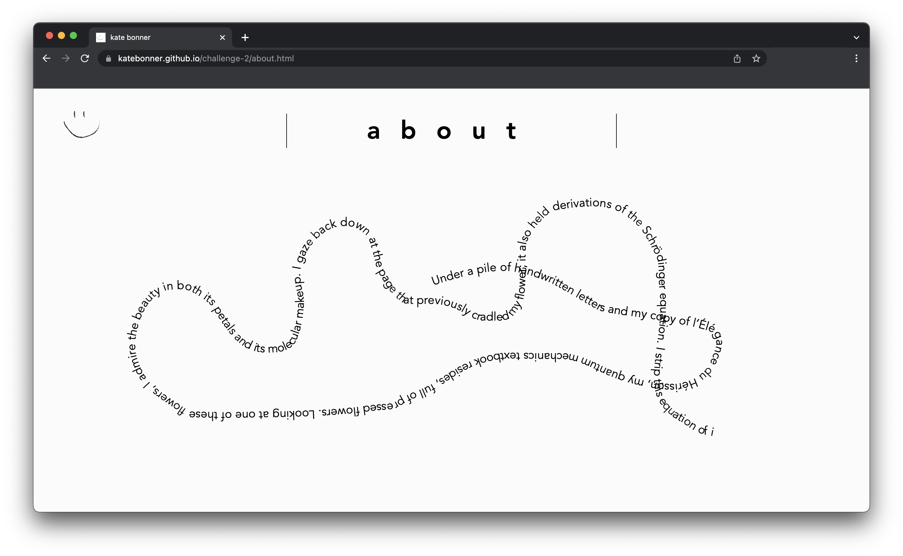
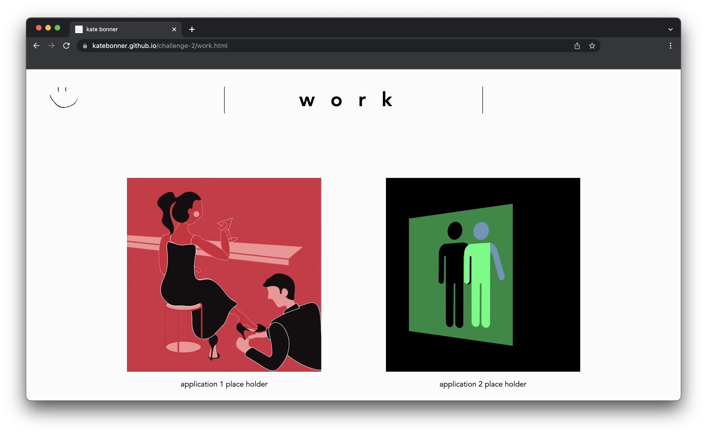
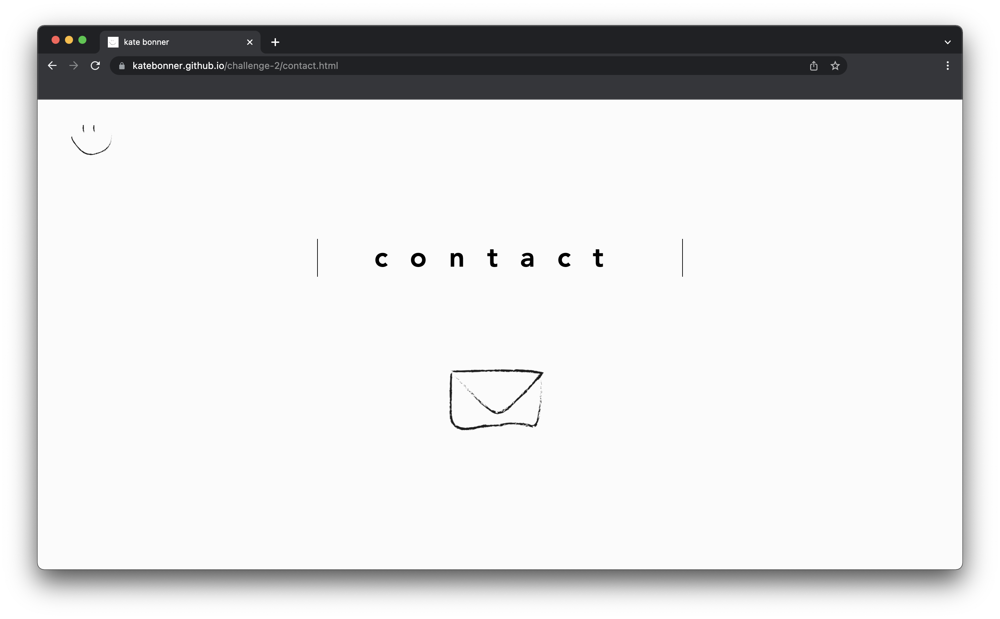

# Columbia University Coding Bootcamp - 02 Advanced CSS Challenge 2: Portfolio

## Description

This project is the first iteration of my creative working portfolio. This iteration presents a basic structure to host a landing page, an 'about' page, a 'work' page with placeholders for future linked applications, and a 'contact' page. The user interface adapts to the user's device, or rather, their screen's width dimension. For reference, I have attached images of the landing page at 3 different screen width ranges:

### Desktop


### Tablet


### Mobile



**Copied here is a link to the deployed application:**
(https://github.com/katebonner/challenge-2)


## Table of Contents 

* [Installation](#installation)
* [Usage](#usage)
* [Credits](#credits)
* [License](#license)


## Installation

To install this project, navigate to your comand line console (for simplicity we will assume you are using terminal) and:

Create a directory in which this project can live.
```md
mkdir <directory-name>
```
Open the directory you just created.
```md
cd <directory-name>
```
Clone this repository.
```md
git clone git@github.com:katebonner/challenge-2.git
```
Open the directory you have just created in your code editor of choice either manually or via:
```md
code .
```

## Usage

This project can be used as refrence when creating your own portfolio to accomplish the following visual and structural tasks:

* Adding a favicon
* Creating css media queries to adapt to different screen widths
* Linking multiple html pages together in a closed loop
    * Note: I present two versions of navigation (the first is commented out)
* Using flexbox on linked images



* Embedding an iframe object -- note: this iframe links to a p5.js project that generates text for any given cursor path



* Linking a silent video to play on loop for any OS



* Linking to an email with a pre-populated subject field


## Credits

This site was built using [GitHub Pages](https://pages.github.com/).


## License

MIT License

Copyright (c) [2022] [Kate Bonner]

Permission is hereby granted, free of charge, to any person obtaining a copy
of this software and associated documentation files (the "Software"), to deal
in the Software without restriction, including without limitation the rights
to use, copy, modify, merge, publish, distribute, sublicense, and/or sell
copies of the Software, and to permit persons to whom the Software is
furnished to do so, subject to the following conditions:

The above copyright notice and this permission notice shall be included in all
copies or substantial portions of the Software.

THE SOFTWARE IS PROVIDED "AS IS", WITHOUT WARRANTY OF ANY KIND, EXPRESS OR
IMPLIED, INCLUDING BUT NOT LIMITED TO THE WARRANTIES OF MERCHANTABILITY,
FITNESS FOR A PARTICULAR PURPOSE AND NONINFRINGEMENT. IN NO EVENT SHALL THE
AUTHORS OR COPYRIGHT HOLDERS BE LIABLE FOR ANY CLAIM, DAMAGES OR OTHER
LIABILITY, WHETHER IN AN ACTION OF CONTRACT, TORT OR OTHERWISE, ARISING FROM,
OUT OF OR IN CONNECTION WITH THE SOFTWARE OR THE USE OR OTHER DEALINGS IN THE
SOFTWARE.


